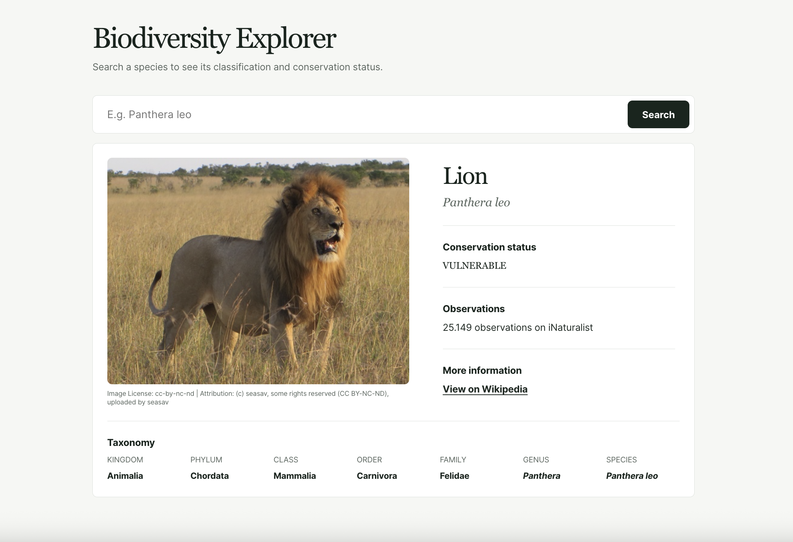

# Biodiversity Explorer

A responsive web application for exploring species information using real-world biodiversity data.

Search for a species by scientific name to view its taxonomy, conservation status, observation data, and representative image.

## Live Demo

[View Biodiversity Explorer](https://katherinebl.github.io/biodiversity-explorer/)



## Features

- Search species by scientific name
- Display taxonomic classification from kingdom to species
- Show conservation status when available
- Display observation counts and common names
- Show representative species images with license and attribution information
- Link to additional information on Wikipedia
- Responsive layout for mobile and desktop

## Data sources

The application combines data from two public biodiversity APIs:

- **GBIF Species API** — scientific names, taxonomy, and conservation status
- **iNaturalist API** — common names, observation counts, images, image attribution, and Wikipedia links

API responses are transformed into internal domain models before being consumed by the UI, keeping external API structures separate from the application's data model.

## Tech stack

- React
- TypeScript
- Vite
- CSS
- GBIF API
- iNaturalist API

## Technical highlights

### Multiple API integration

Species data is composed from GBIF and iNaturalist while keeping each external API response type separate from the application's internal `Species` model.

### Image layout stability

Image dimensions provided by iNaturalist are propagated through the application and rendered using native `width` and `height` attributes. This allows the browser to determine the image aspect ratio before the resource finishes loading, preventing layout shifts caused by species images.

### Responsive design

The interface uses mobile-first CSS, reusable spacing custom properties, and responsive layout changes for the species details and taxonomy.

## Running locally

Clone the repository and install the dependencies:

```bash
npm install
```

Start the development server:

```bash
npm run dev
```

Create a production build:

```bash
npm run build
```

Run ESLint:

```bash
npm run lint
```
